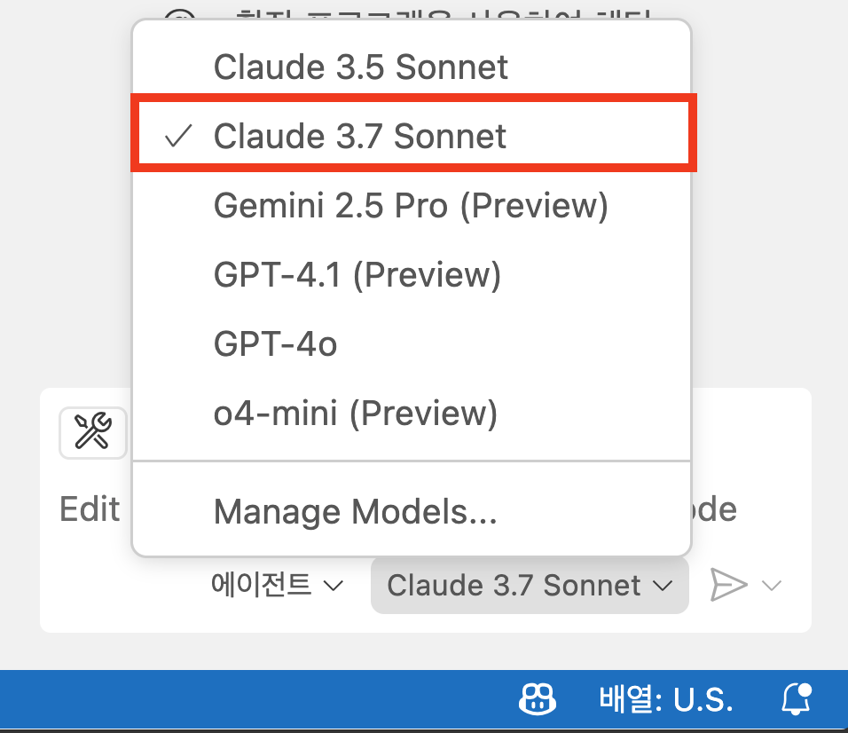

# 백엔드 API 개발

## 사전 준비 사항

이전 [STEP 01 : 프롬프트 입력을 위한 기본 설정](./step-01.md)에서 프롬프트 입력을 위한 파일들을 모두 복사한 상태라고 가정합니다.

## 리포지토리 루트 설정

1. 아래 명령어를 실행시켜 `$REPOSITORY_ROOT` 환경 변수를 설정합니다.

   ```bash
   # Bash/Zsh
   REPOSITORY_ROOT=$(git rev-parse --show-toplevel)
   ```

   ```powershell
   # PowerShell
   $REPOSITORY_ROOT = git rev-parse --show-toplevel
   ```

## 프로젝트 실행

1. 처음 [STEP 00 : 개발 환경 설정](./step-00.md) 단계에서 익스텐션을 정상적으로 설치했다면, 다음과 같은 아이콘을 확인할 수 있습니다.
   

   아이콘을 클릭해 chat 기능을 활성화하면, 다음과 같은 화면을 볼 수 있습니다.
   

   > 🥕 팁 : 만약 익스텐션을 설치했음에도 보이지 않는다면, `ctrl+alt+i` 키를 누르거나 `ctrl+cmd+i` 키를 눌러 chat을 엽니다.

2. 다음 과정들을 통해 `agent` 모드로 변경합니다.
   
   
3. 다음 과정들을 통해 AI 모델을 `Claude 3.7 Sonnet`으로 변경합니다.
   
   
4. 코파일럿이 현재 파일을 더 빠르게 인식할 수 있도록 `backend/api-document.yaml` 파일을 클릭해 열어줍니다.
   
5. 이제 다음 내용을 프롬프트에 입력합니다.
   ```text
   "api-document.yaml` 파일에 명시된 paths, models를 토대로 FastAPI 백엔드 프로젝트를 생성해줘
   ```
6. 이제 프로젝트의 오류를 마주칠 때 해당 오류를 수정해달라는 내용을 프롬프트에 입력합니다.
   > 🥕 팁 : 바이브 코딩의 묘미는 "해줘"체를 사용하는 것입니다.
