# 백엔드 API 개발

## 사전 준비 사항

이전 [STEP 01 : 프롬프트 입력을 위한 기본 설정](./step-01.md)에서 모든 설정을 마친 상태라고 가정합니다.

## GitHub Copilot 시작

1. 처음 [STEP 00 : 개발 환경 설정](./step-00.md) 단계에서 익스텐션을 정상적으로 설치했다면, 다음과 같은 아이콘을 확인할 수 있습니다.
   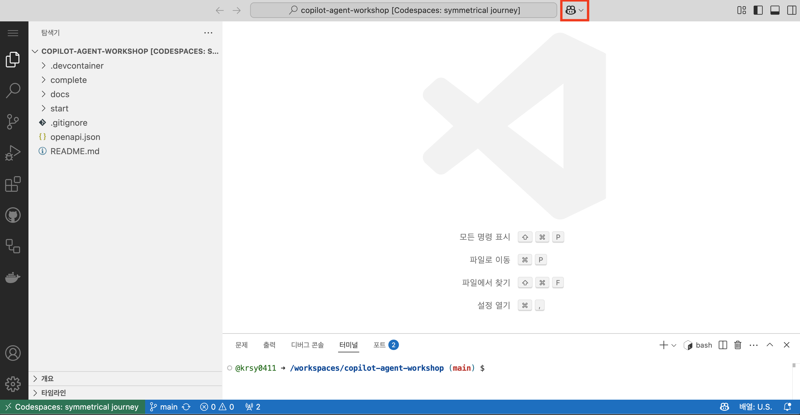

   아이콘을 클릭해 chat 기능을 활성화하면, 아래와 같은 화면을 볼 수 있습니다.

   > 🥕 팁 : 만약 익스텐션을 설치했음에도 보이지 않는다면, `ctrl+alt+i` 키를 누르거나 `ctrl+cmd+i` 키를 눌러 chat을 엽니다.

   > 💡 참고 : 만약 아래 이미지와 같은 화면이 아닌 다른 화면(회원가입)이 보이는 경우, [GitHub Copilot Signup](https://github.com/github-copilot/signup)에서 코파일럿 회원가입을 진행한 후 codespaces로 돌아와주세요.

   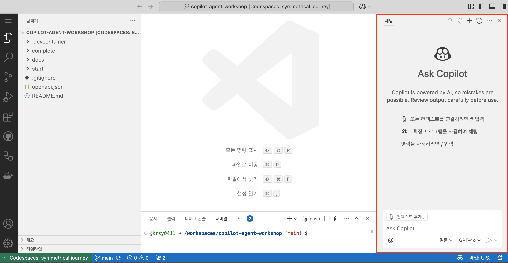

2. 다음 과정들을 통해 `agent` 모드로 변경합니다.
   
   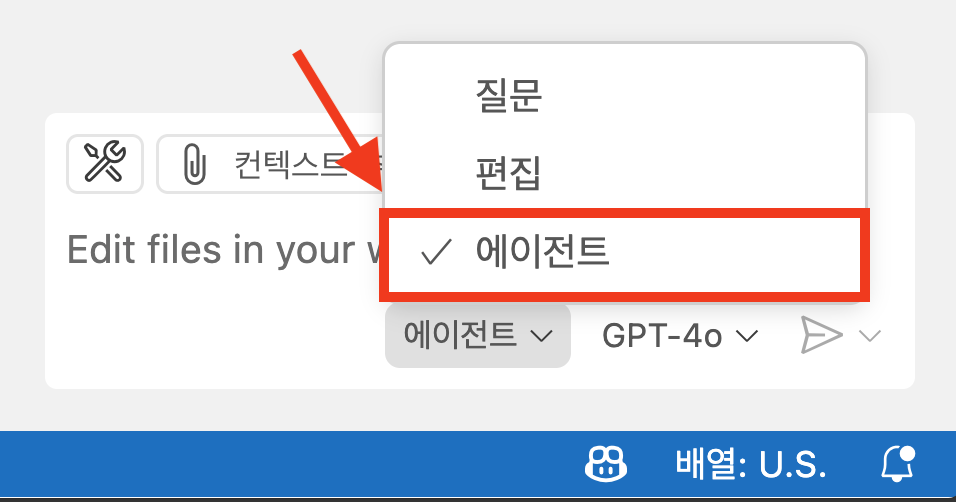
3. 다음 과정들을 통해 AI 모델을 `Claude 3.7 Sonnet`으로 변경합니다.
   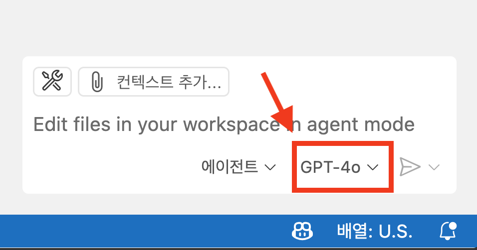
   

   > 🥕 팁 : 만약 Claude 3.7 Sonnet 모델이 보이지 않는다면?
   >
   > `GPT-4o` -> `GPT-4.1` -> `Claude 3.5 Sonnet` 순으로 설정해주세요.

## GitHub Copilot 실행

1. 다음 내용을 GitHub Copilot 프롬프트에 입력합니다.

   ```text
   backend 폴더 안에 FastAPI 프로젝트를 생성해줘. openapi.json 파일의 paths 변수들을 사용해 경로를 구성하면 돼.  각 경로가 참조하는 schema는 components/schemas 객체를 보고 생성하면 돼
   ```

   > ⚠️ 주의 : 코파일럿이 코드를 모두 작성하면 프로젝트 실행 방법에 대해 알려줍니다. 우선은 실행하지 마세요.
   >
   > 만약 `continue`를 클릭하다 프로젝트가 실행되었는데 오류가 발생했다면, 실행중인 터미널에서 `ctrl+c`를 입력하여 프로그램을 중지해주세요. 이후 2번 과정부터 이어서 수행하면 됩니다.

2. 프로젝트가 하나 만들어졌다면, 프론트엔드 연결을 위해 CORS 에러를 해결해줘야합니다. 다음 문장을 GitHub Copilot 프롬프트에 입력합니다.
   ```text
   http://localhost:3000, http://127.0.0.1:3000 주소에 대해 CORS 에러가 안 나도록 수정해줘
   ```
3. 다음 내용을 GitHub Copilot 프롬프트에 입력합니다.
   ```text
   프로젝트를 실행하기 위한 과정을 backend/README.md 파일에 작성해줘
   ```
4. 이제 `keep(유지)` 버튼을 눌러 파일을 저장합니다.
   
5. GitHub Copilot 프롬프트에 다음 내용을 입력해 프로젝트를 실행하도록 지시합니다.
   ```text
   backend/README.md 파일을 참고해서 backend 애플리케이션을 실행해줘
   ```
6. 프로젝트를 실행했다면, 이제 프로젝트의 오류를 마주칠 때 해당 오류를 수정해달라는 내용을 GitHub Copilot 프롬프트에 입력합니다.
   ```text
   # 예시
   1. "CORS 에러가 나는데, 수정해줘"
   2. 터미널 오류 메세지를 프롬프트에 복사+붙여넣기한 후, "이거 수정해줘"
   ```
   > 🥕 팁 : 바이브 코딩의 묘미는 "해줘(해주세요)"체를 사용하는 것입니다.

## 애플리케이션 실행

1. 모든 오류가 수정되어 애플리케이션이 정상 작동하면, 다음과 같이 `브라우저에서 열기` 버튼을 눌러 애플리케이션 실행 화면으로 이동합니다.

   > 💡 참고 : Visual Studio Code를 사용 중이라면, 애플리케이션 실행 후 [http://localhost:8000](http://localhost:8000)으로 이동하면 됩니다.

   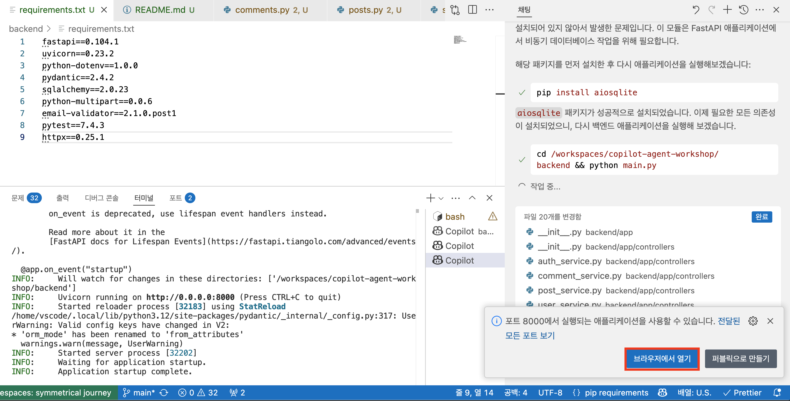

2. 백엔드 애플리케이션 URL 뒤에 `/docs` 경로를 붙여 이동합니다.

   > 💡 참고 : Visual Studio Code를 사용 중이라면, [http://localhost:8000/docs](http://localhost:8000/docs)로 이동하면 됩니다.

   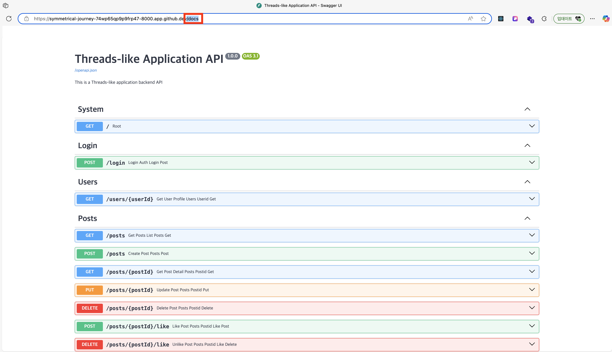

### 애플리케이션 테스트

#### login 경로

먼저 login 기능부터 테스트 해보겠습니다.

1. `POST /login`을 클릭합니다.
   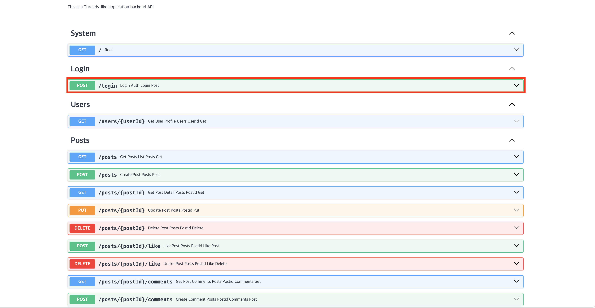
2. `Try it out` 버튼을 클릭합니다.
   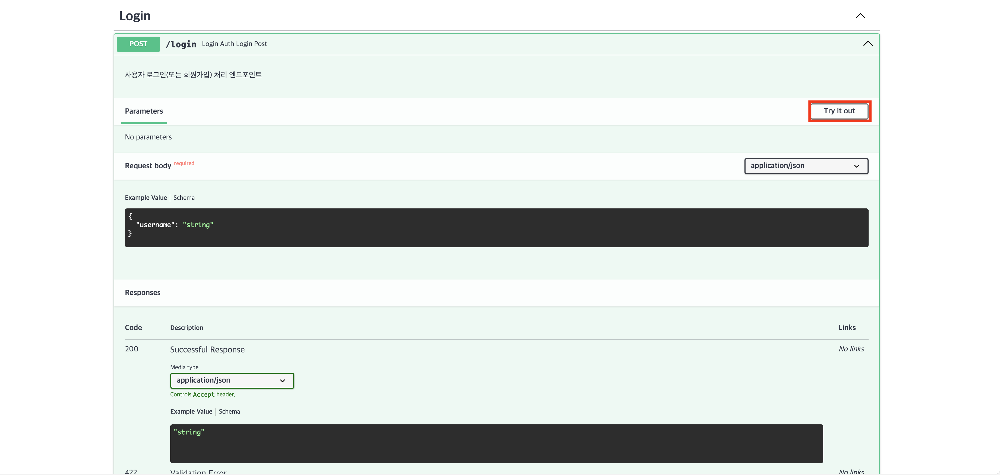
3. 쌍따옴표("") 안에 사용하고자 하는 `username`을 입력합니다. 그리고 `Execute` 버튼을 클릭합니다.
   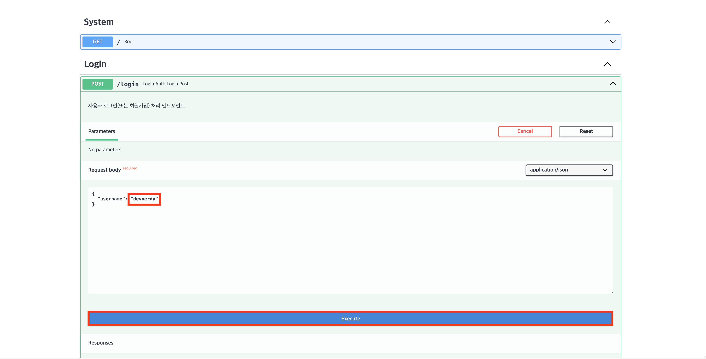
4. 200번대 상태 코드와 함께 정상적으로 응답하는 것을 확인합니다.
   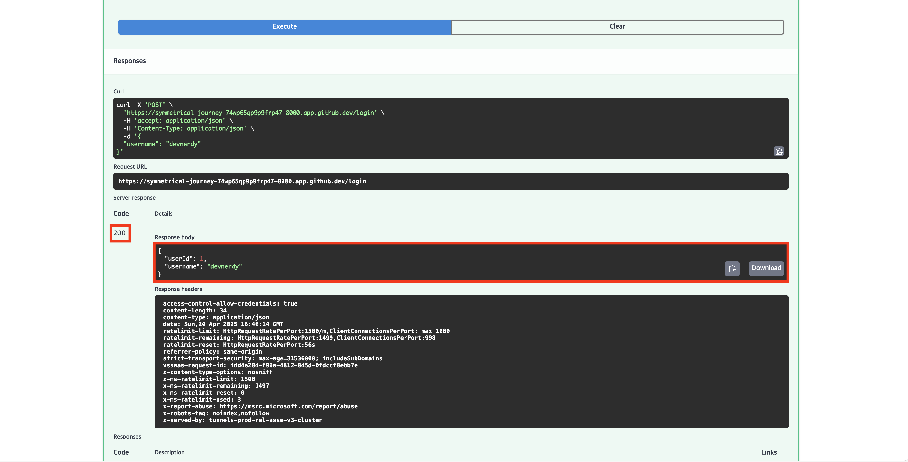

#### posts 경로

이번엔 post 기능을 테스트해보겠습니다.

1. `POST /posts`를 클릭합니다.
   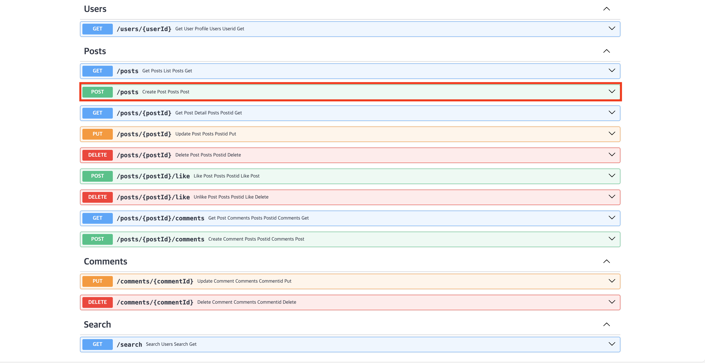
2. `Try it out` 버튼을 클릭합니다.
   
3. 쌍따옴표("") 안에 `게시물 내용`과 방금 만들어뒀던 `username`을 입력합니다. 그리고 `Execute` 버튼을 클릭합니다.
   
4. 200번대 상태 코드와 함께 정상적으로 응답하는 것을 확인합니다.
   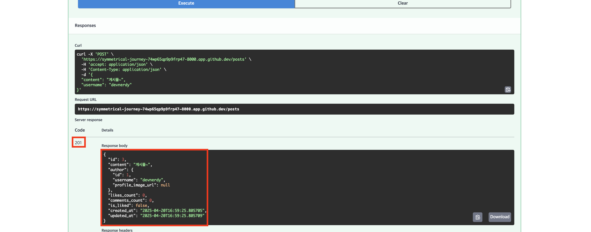

> 다른 기능들도 데이터를 넣어 테스트 해봅니다.

### 애플리케이션 종료

테스트가 끝났다면, 실행 중인 터미널에 `ctrl+c` 키를 입력해 프로그램을 종료합니다.

## 번외) 완성된 버전의 백엔드 프로젝트를 실행해보고 싶다면?

1. 아래 명령어를 터미널에 입력합니다.
   ```bash
   cd $REPOSITORY_ROOT/complete/backend
   ```
2. 아래 명령어를 터미널에 입력해 `.env` 파일을 생성합니다.

   > ⚠️ 주의 : 자신이 사용 중인 터미널 종류에 따라 다음 두 명령어 중 하나를 입력합니다.

   ```bash
   # Bash/Zsh
   touch .env
   ```

   ```powershell
   # PowerShell
   New-Item -Path .env -ItemType File
   ```

3. `.env` 파일을 열고 다음 내용을 입력합니다.

   ```text
   DATABASE_URL=sqlite:///./threads_app.db
   API_VERSION=0.1.0
   DEBUG=True
   ```

4. 다음 내용을 GitHub Copilot 프롬프트에 입력합니다.
   ```text
   complete/backend/README.md 파일을 참고해서 complete/backend 애플리케이션을 실행해줘
   ```

---

수고하셨습니다!! **백엔드 API 개발** 부분이 끝났습니다. 이제 [STEP 03 : 도커로 어디서나 실행 가능한 워크샵 환경 만들기](./step-03.md) 단계로 넘어가겠습니다.
