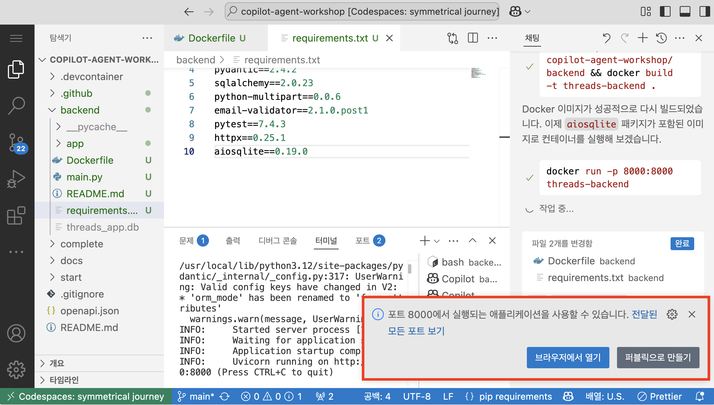

# 도커로 어디서나 실행 가능한 워크샵 환경 만들기

## 사전 준비 사항

이전 [STEP 02 : 백엔드 API 개발](./step-02.md)에서 백엔드 API 개발용 소스코드 파일들을 모두 생성한 상태라고 가정합니다. 만약 STEP 2에서 완성한 프로그램을 실행 중이라면 종료해주세요.

#### 만약 STEP 02를 완료하지 못했다면?

[STEP 02 : 번외](./step-02.md#extra-completed-backend)에서 설명한 방법으로 완성된 백엔드 프로젝트를 복사할 수 있습니다.

> 💡 참고 : `complete/backend` 프로젝트를 복사하면, 이미 내부에 Dockerfile이 준비되어있기 때문에 복사된 프로젝트에서 `Dockerfile`을 삭제해주세요.

## 도커 컨테이너 실행

1. **새 터미널**을 열고, 아래 명령어를 입력해 `$REPOSITORY_ROOT` 환경 변수를 설정합니다.

   > ⚠️ 주의 : 자신이 사용 중인 터미널 종류에 따라 다음 두 명령어 중 하나를 입력합니다.

   ```bash
   # Bash/Zsh
   REPOSITORY_ROOT=$(git rev-parse --show-toplevel)
   ```

   ```powershell
   # PowerShell
   $REPOSITORY_ROOT = git rev-parse --show-toplevel
   ```

2. 이어서 `backend` 폴더로 경로를 이동합니다.
   ```bash
   cd $REPOSITORY_ROOT/backend
   ```
3. 아래 명령어를 터미널에 입력해 도커 엔진을 실행하고 있는 지 다시 확인합니다.

   ```bash
   docker info
   ```

   > ⚠️ 주의 : 시스템 정보가 출력되지 않고 에러 메세지가 나온다면, 도커 데스크탑을 설치 및 실행해주세요.

4. 프롬프트에 다음 내용을 입력해 코파일럿이 `backend` 프로젝트에서 Dockerfile을 작성하도록 합니다.

   ```text
   backend 경로에 있는 프로젝트를 위한 Dockfile을 backend 폴더 안에 작성해줘
   ```

5. 프롬프트에 다음 내용을 입력해 코파일럿이 `backend` 프로젝트를 컨테이너로 실행할 수 있도록 합니다.

   ```text
   backend/Dockerfile을 이용해 컨테이너를 실행해줘
   ```

6. 프로젝트를 실행했다면, 이제 프로젝트의 오류를 마주칠 때 해당 오류를 수정해달라는 내용을 GitHub Copilot 프롬프트에 입력합니다.

   ```text
   # 예시
   1. "CORS 에러가 나는데, 수정해줘"
   2. 터미널 오류 메세지를 프롬프트에 복사+붙여넣기한 후, "이거 수정해줘"
   ```

7. 모든 오류가 수정되어 애플리케이션이 정상 작동하면, 다음과 같이 `브라우저에서 열기` 버튼을 눌러 애플리케이션 실행 화면으로 이동합니다.

   > 💡 참고 : Visual Studio Code를 사용 중이라면, 애플리케이션 실행 후 [http://localhost:8000](http://localhost:8000)으로 이동하면 됩니다.

   

8. 백엔드 애플리케이션 URL 뒤에 `/docs` 경로를 붙여 이동합니다.

   > 💡 참고 : Visual Studio Code를 사용 중이라면, [http://localhost:8000/docs](http://localhost:8000/docs)로 이동하면 됩니다.

   

9. 이제 앱을 테스트해봅니다. [STEP 02의 애플리케이션 테스트 섹션](./step-02.md#application-test)을 참고합니다.

---

축하합니다!! `도커로 어디서나 실행 가능한 워크샵 환경 만들기`까지 끝났습니다!! 이제 바이브 코딩을 이용한 여러분만의 애플리케이션 개발에 도전해보세요!!
